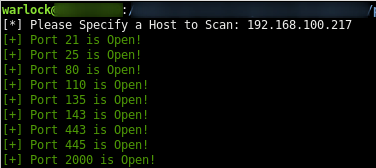

# Ethical-Hacking-Python-Scripts

## Scanner Scripts
1. **portScan.py:** A simple port scanner coded in Python that asks to specify an IP address. With this IP address, the script will scan the first 1000 ports and print out which ports are open and which ports are closed.\
